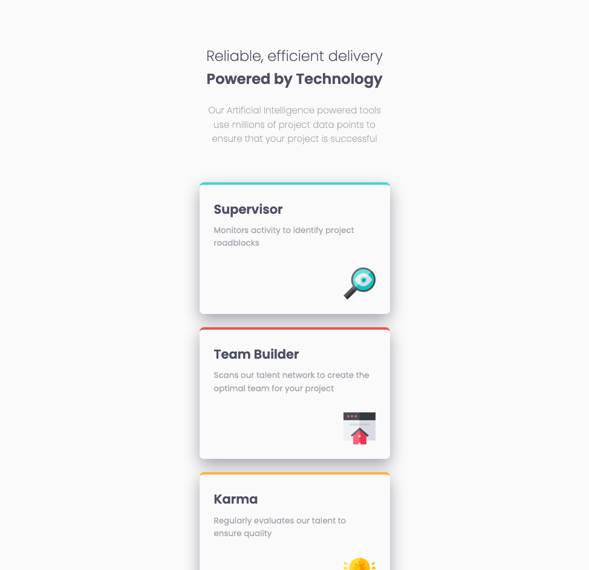

<h1> Frontend Mentor - Four card feature section solution</h1>

<br>

This is a solution to the [Four card feature section challenge on Frontend Mentor](https://www.frontendmentor.io/challenges/four-card-feature-section-weK1eFYK). Frontend Mentor challenges help you improve your coding skills by building realistic projects.

<br>

## <b>Table of contents</b>

- [Overview](#overview)
  - [Screenshots](#screenshots)
  - [Links](#links)
- [My process](#my-process)
  - [Built with](#built-with)
  - [What I learned](#what-i-learned)
- [Mentions](#mentions)
- [Author](#author)

<br>

---

<br>

## Overview

### Screenshots

<br>

Desktop


Desktop - Dark Mode


Mobile


<br>

---

<br>

### Links

 
👉 Solution Frontend Mentor: [Frontend solution](https://www.frontendmentor.io/solutions/four-card-e_NnTSp22u)

👉 Live Site: [Live site with GitHub Pages](https://marioferrer.github.io/FM-10_four-card/)

<br>

---

<br>

## My Process

<br>

### Built with
<br>


  - BEM


  - CSS custom properties
  - Flexbox


<br>

----

<br>


### What I learned


I have learned how to set the dark mode with `@media (prefers-color-scheme: dark)`.
Here is an example, the code is this:


SCSS
```scss
@media (prefers-color-scheme: dark) {
    background-color: var(--dark-blue);
  }
```

<br>

---

<br>

## Mentions

I have used and modified Eduardo Fierro's reset, here is his github profile. <br>
[Eduardo's github profile](https://github.com/eduardofierropro/Reset-CSS)

<br>

---

<br>

## Author

- Github - [My GitHub Profile](https://github.com/marioferrer)
- Frontend Mentor - [@marioferrer](https://www.frontendmentor.io/profile/marioferrer)


